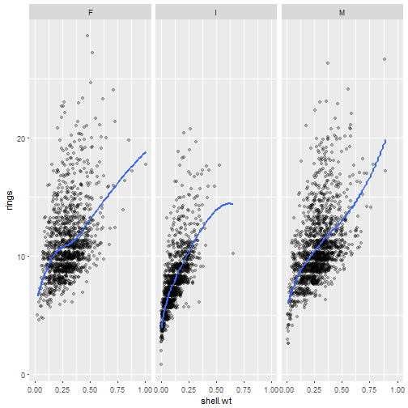

---

title: "Abalone dataset analysis"
author: "Vital"
date: "August 30, 2017"
output: html_document

---


## Main idea:
With this app you can investigate how lm, rf, gbm and c50 works using abalone dataset

       -please choose any columns to add or remove
       -you should use all genders to enter ML tab (classification task)
       -plots will dynamically fit to your needs
       -investigate how outliers affect lm line
       -research how number of predictors builds an outcome
       
---
       
##LM  abalone relationship: number of rings as outcome with shell.wt as predictor




---


## ML with only 2 predictors: length and diametter (rf)


```
## note: only 2 unique complexity parameters in default grid. Truncating the grid to 2 .
```

```
## Random Forest 
## 
## 3134 samples
##    3 predictor
##    3 classes: 'F', 'I', 'M' 
## 
## No pre-processing
## Resampling: Cross-Validated (5 fold, repeated 3 times) 
## Summary of sample sizes: 2505, 2508, 2508, 2507, 2508, 2508, ... 
## Resampling results across tuning parameters:
## 
##   mtry  Accuracy   Kappa    
##   2     0.4961645  0.2424967
##   3     0.4896789  0.2326121
## 
## Accuracy was used to select the optimal model using  the largest value.
## The final value used for the model was mtry = 2.
```


---


## Updating number of predictors and precision increases


```
## Random Forest 
## 
## 3134 samples
##    8 predictor
##    3 classes: 'F', 'I', 'M' 
## 
## No pre-processing
## Resampling: Cross-Validated (5 fold, repeated 3 times) 
## Summary of sample sizes: 2507, 2507, 2508, 2507, 2507, 2508, ... 
## Resampling results across tuning parameters:
## 
##   mtry  Accuracy   Kappa    
##   2     0.5467949  0.3175653
##   5     0.5465805  0.3173259
##   8     0.5449866  0.3151466
## 
## Accuracy was used to select the optimal model using  the largest value.
## The final value used for the model was mtry = 2.
```


